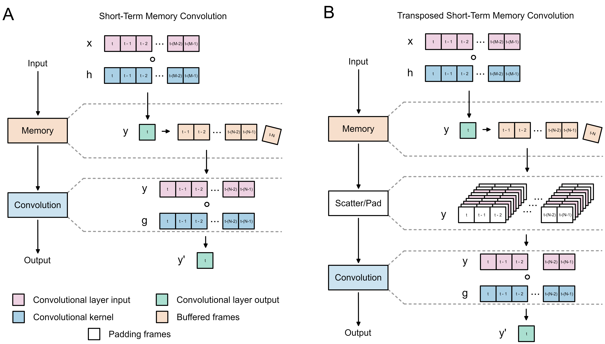
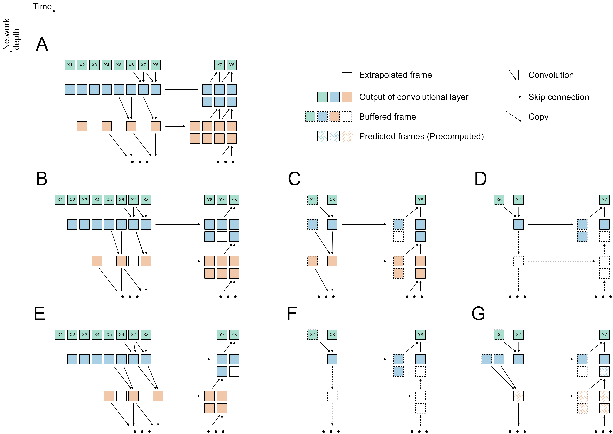
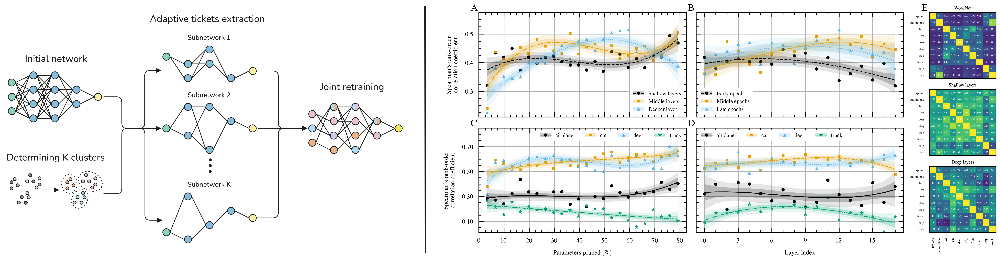

  

    
    
<!--     
     -->
  

  <h2>
    Hi 👋, I’m Grzegorz Stefański.
  </h2>

### About Me :
I'm a research scientist working at Samsung AI Center Warsaw. My experiance resolves around:
- Audio AI 
- Computer Vision
- Data Synthetisation
- DNN Computational Complexity Reduction
- Bio-Inspired Artificial Intelligence

### My Publications
#### [Short-Term Memory Convolutions](https://arxiv.org/abs/2302.04331), International Conference on Learning Representations (ICLR), 2023

The real-time processing of time series signals is a critical issue for many real-life applications. The idea of real-time processing is especially important in audio domain as the human perception of sound is sensitive to any kind of disturbance in perceived signals, especially the lag between auditory and visual modalities. The rise of deep learning (DL) models complicated the landscape of signal processing. Although they often have superior quality compared to standard DSP methods, this advantage is diminished by higher latency. In this work we propose novel method for minimization of inference time latency and memory consumption, called Short-Term Memory Convolution (STMC) and its transposed counterpart. The main advantage of STMC is the low latency comparable to long short-term memory (LSTM) networks. Furthermore, the training of STMC-based models is faster and more stable as the method is based solely on convolutional neural networks (CNNs). In this study we demonstrate an application of this solution to a U-Net model for a speech separation task and GhostNet model in acoustic scene classification (ASC) task. In case of speech separation we achieved a 5-fold reduction in inference time and a 2-fold reduction in latency without affecting the output quality. The inference time for ASC task was up to 4 times faster while preserving the original accuracy.

  

#### [SOI: Scaling Down Computational Complexity by Estimating Partial States of the Model](https://arxiv.org/abs/2410.03813), Conference on Neural Information Processing Systems (NeurIPS), 2024

Consumer electronics used to follow the miniaturization trend described by Moore's Law. Despite increased processing power in Microcontroller Units (MCUs), MCUs used in the smallest appliances are still not capable of running even moderately big, state-of-the-art artificial neural networks (ANNs) especially in time-sensitive scenarios. In this work, we present a novel method called Scattered Online Inference (SOI) that aims to reduce the computational complexity of ANNs. SOI leverages the continuity and seasonality of time-series data and model predictions, enabling extrapolation for processing speed improvements, particularly in deeper layers. By applying compression, SOI generates more general inner partial states of ANN, allowing skipping full model recalculation at each inference.

  

#### [Routing the Lottery: Adaptive Subnetworks for Heterogeneous Data](https://arxiv.org/abs/2601.22141), Preprint

The Lottery Ticket Hypothesis posits that large networks contain sparse subnetworks, or winning tickets, that can be trained in isolation to match the performance of their dense counterparts. However, most existing approaches assume a single universal winning ticket shared across all inputs, ignoring the inherent heterogeneity of real-world data. In this work, we propose Routing the Lottery (RTL), an adaptive pruning framework that discovers multiple specialized subnetworks, called adaptive tickets, each tailored to a class, semantic cluster, or environmental condition. Across diverse datasets and tasks, RTL consistently outperforms single- and multi-model baselines in balanced accuracy and recall, while using up to 10 times fewer parameters than independently pruned models and producing semantically aligned subnetworks. Furthermore, we identify subnetwork collapse, a performance drop under aggressive pruning, and introduce a subnetwork similarity score that enables label-free diagnosis of oversparsification. Overall, our results recast pruning as a mechanism for aligning model structure with data heterogeneity, paving the way toward more modular and context-aware deep learning.

  

---

### :hammer_and_wrench: Languages and Tools :

  &nbsp;
  &nbsp;
  &nbsp;
  &nbsp;
  &nbsp;
  &nbsp;
  &nbsp;
  &nbsp;
  &nbsp;
  &nbsp;
  &nbsp;
  &nbsp;
  &nbsp;
  &nbsp;
  &nbsp;
  &nbsp;

<!-- 
### :writing_hand: Publications :

-->
